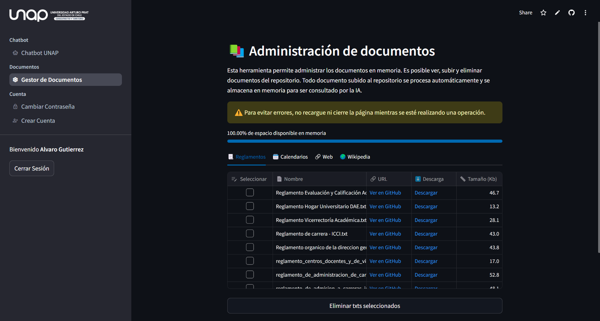

# Chatbot UNAP 🤖

Desarrollo de chatbot consciente de documentos y reglamentos pertinentes a la universidad Arturo Prat y la carrera de Ingenieria Civil en Computacion e Informatica.

Disponible en: <https://unap-chatbot.streamlit.app/>

## Links

- Agente: <https://unap-chatbot.streamlit.app/>
- Modelo de chat: <https://unap-chatbot-llm.streamlit.app/>
- Visualizadora de data: <https://unap-chatbot-stats.streamlit.app/>

## Servicios utilizados

- [**OpenAI API**](https://openai.com/blog/openai-api) para la generacion de las respuestas. Modelo *gpt4o-mini*.
- [**Pinecone**](https://www.pinecone.io/) como base de datos de vectores.
- [**Streamlit/Streamlit Cloud**](https://streamlit.io/) para el frontend y deploy de la herramienta.

---

## Screenshots

### Vistas Usuario

#### Vista inicial Usuario

#### Vista con sidebar expandido

#### Vista con pregunta y su respuesta

### Vistas Admin

#### Vista inicial Admin

#### Vista gestor de documentos

#### Vista cambio de contraseña

#### Vista registro de usuario

